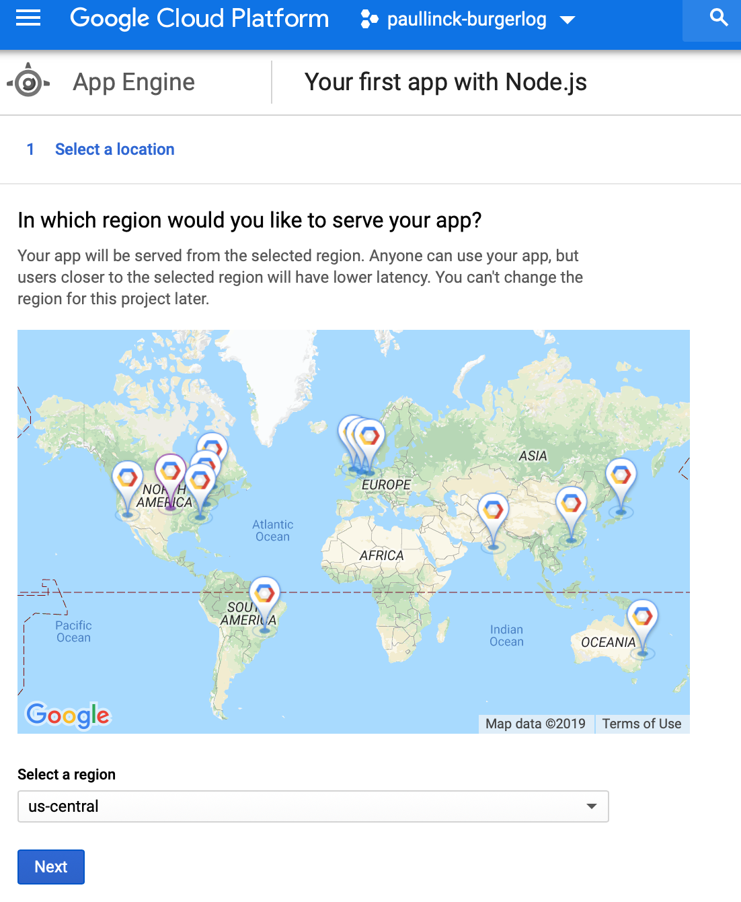
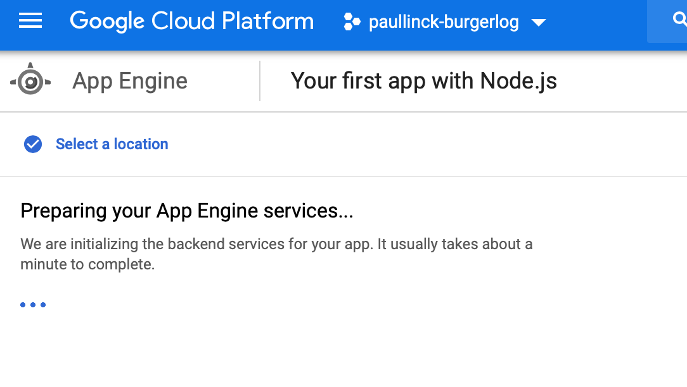
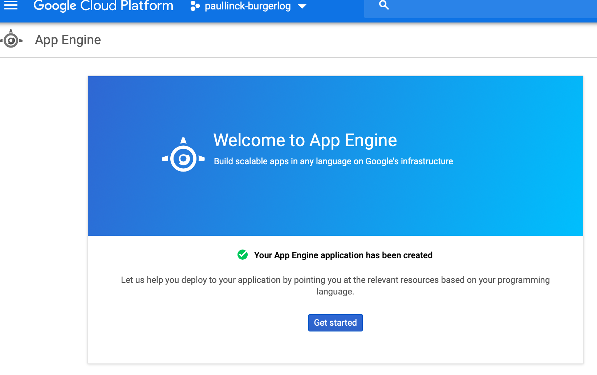
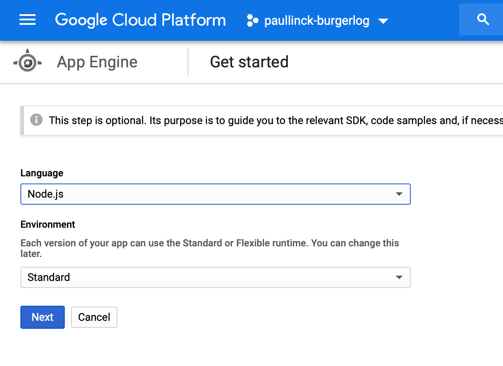
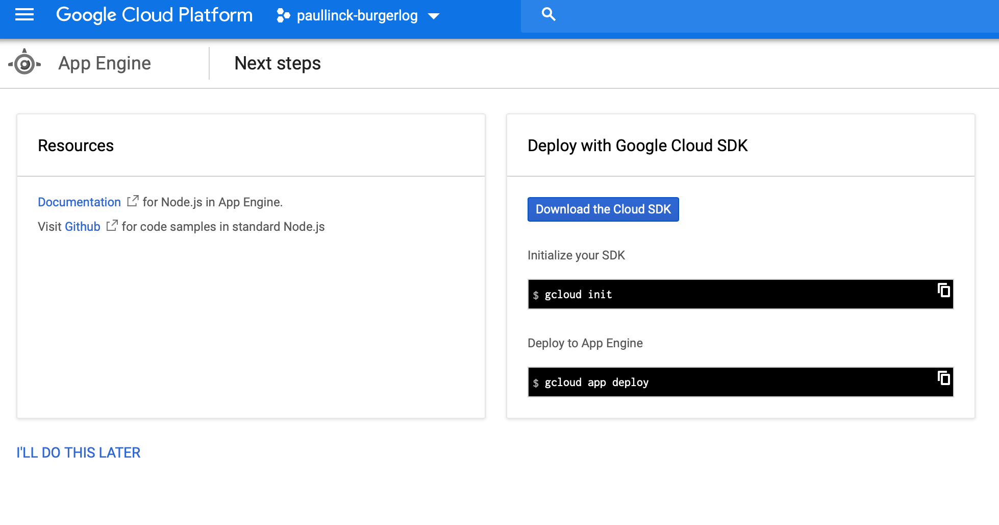
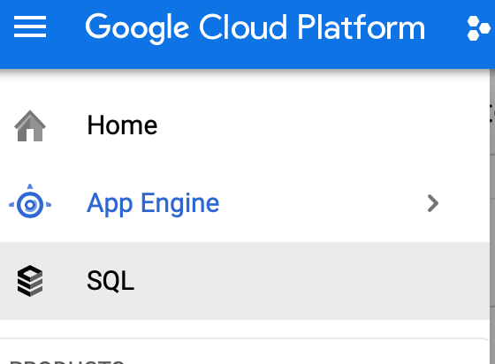
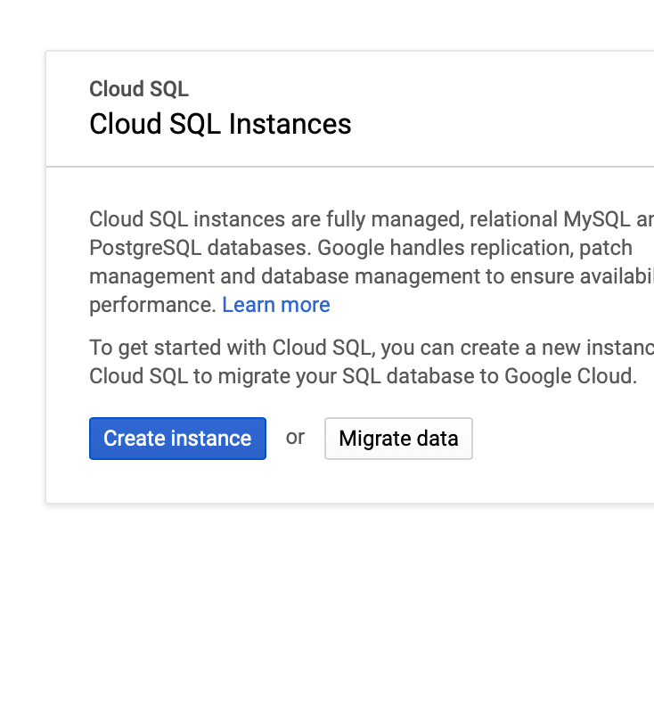
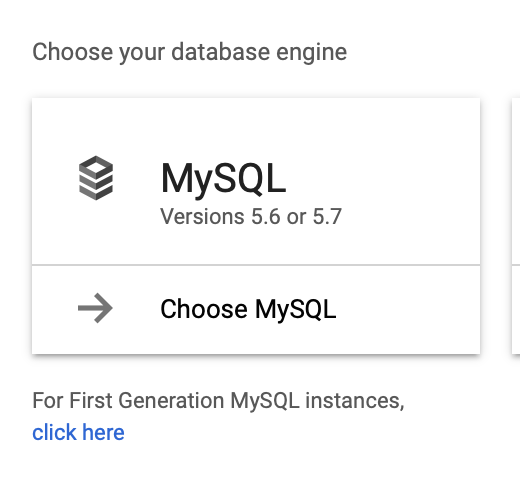
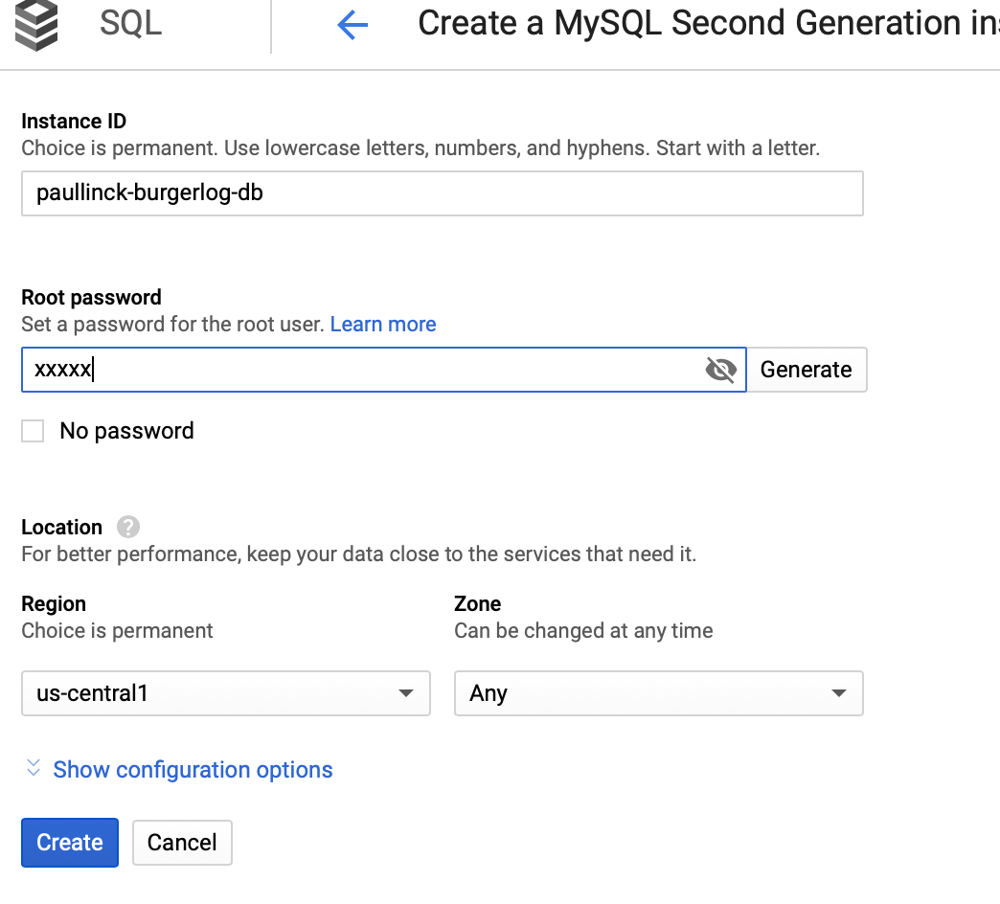
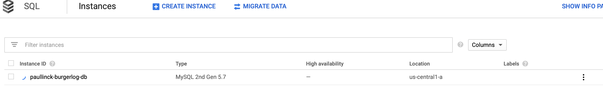

# Creation Steps

1. Create Google Cloud Project (GCP)

    * `gcloud projects create paullinck-burgerlog`

2. Enable AppEngine for the project

    * select location `us-central`
    * 
    * Wait ...
    * 
    * Start Configuring for Node.js
    * 
    * Pick node.js
    * 
    * Wait ...
    * 

3. Setup Database

    * 
    * 
    * 
    * 
    * 

